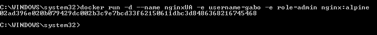

# Variables de Entorno
### ¿Qué son las variables de entorno?
Son valores que se configuran en el entorno de ejecución de un sistema operativo y se utilizan para almacenar información que puede ser compartida por múltiples procesos. Estas variables permiten configurar aplicaciones dentro de contenedores sin modificar el código. 

### Para crear un contenedor con variables de entorno?

```
docker run -d --name <nombre contenedor> -e <nombre variable1>=<valor1> -e <nombre variable2>=<valor2>
```

### Crear un contenedor a partir de la imagen de nginx:alpine con las siguientes variables de entorno: username y role. Para la variable de entorno rol asignar el valor admin.

```
docker run -d --name nginxUA -e username=gabo -e role=admin nginx:alpine
```




### Crear un contenedor con mysql:8 , mapear todos los puertos
```
docker run -d --name mysql -p 8080:3306 mysql:8
```

### ¿El contenedor se está ejecutando?
No se está ejecutando. 


### Identificar el problema
```
docker logs mysql
```

MySQL no puede iniciar porque no se ha proporcionado una contraseña para el usuario root, y la base de datos está sin inicializar.

### Eliminar el contenedor creado con mysql:8 
```
docker rm mysql

```


### Para crear un contenedor con variables de entorno especificadas
- Portabilidad: Las aplicaciones se vuelven más portátiles y pueden ser desplegadas en diferentes entornos (desarrollo, pruebas, producción) simplemente cambiando el archivo de variables de entorno.
- Centralización: Todas las configuraciones importantes se centralizan en un solo lugar, lo que facilita la gestión y auditoría de las configuraciones.
- Consistencia: Asegura que todos los miembros del equipo de desarrollo o los entornos de despliegue utilicen las mismas configuraciones.
- Evitar Exposición en el Código: Mantener variables sensibles como contraseñas, claves API, y tokens fuera del código fuente reduce el riesgo de exposición accidental a través del control de versiones.
- Control de Acceso: Los archivos de variables de entorno pueden ser gestionados con permisos específicos, limitando quién puede ver o modificar la configuración sensible.

Previo a esto es necesario crear el archivo y colocar las variables en un archivo, **.env** se ha convertido en una convención estándar, pero también es posible usar cualquier extensión como **.txt**.
```
docker run -d --name <nombre contenedor> --env-file=<nombreArchivo>.<extensión> <nombre imagen>
```
**Considerar**
Es necesario especificar la ruta absoluta del archivo si este se encuentra en una ubicación diferente a la que estás ejecutando el comando docker run.

### Crear un contenedor con mysql:8 , mapear todos los puertos y configurar las variables de entorno mediante un archivo

```
docker run -d --name mysqlP --env-file=C:\Users\Gabriel\Desktop\EVOLUCION_SOFTWARE\2024B-ISWD633-practica2\variablesMYSQL.env -p 8080:3306 mysql:8
```


```
docker exec -it mysql mysql -u root -p

```

### ¿Qué bases de datos existen en el contenedor creado?
Existen 5 bases de datos
- baseDeDatosPrueba: Esta es probablemente la base de datos que creaste para pruebas.
- information_schema: Base de datos que contiene información sobre todas las demás bases de datos.
- mysql: Base de datos que almacena información sobre los usuarios y privilegios de MySQL.
- performance_schema: Proporciona información sobre el rendimiento del servidor MySQL.
- sys: Base de datos que contiene vistas que ayudan a mejorar el rendimiento y la gestión de la base de datos.


