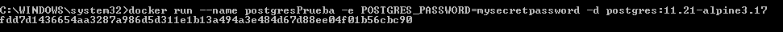
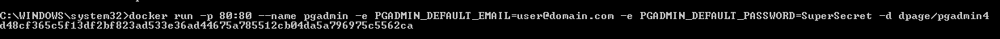
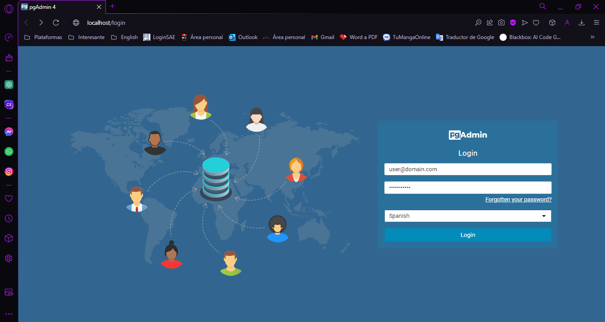
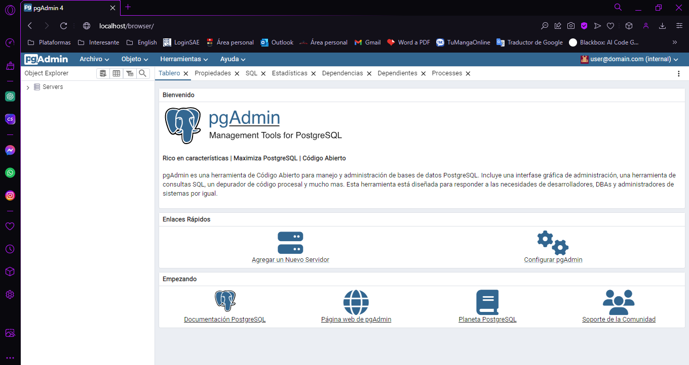
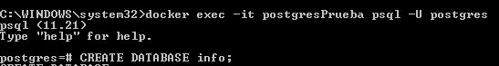
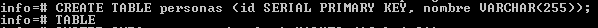
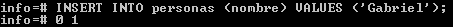
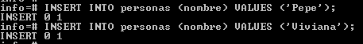
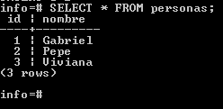

### Crear contenedor de Postgres sin que exponga los puertos. Usar la imagen: postgres:11.21-alpine3.17

```
docker run --name postgresPrueba -e POSTGRES_PASSWORD=mysecretpassword -d postgres:11.21-alpine3.17
```


### Crear un cliente de postgres. Usar la imagen: dpage/pgadmin4
```
docker run -p 80:80 --name pgadmin -e PGADMIN_DEFAULT_EMAIL=user@domain.com -e PGADMIN_DEFAULT_PASSWORD=SuperSecret -d dpage/pgadmin4

```


# COMPLETAR

La figura presenta el esquema creado en donde los puertos son:
- a: 80
- b: 80
- c: 5432


## Desde el cliente
### Acceder desde el cliente al servidor postgres creado.




### Crear la base de datos info, y dentro de esa base la tabla personas, con id (serial) y nombre (varchar), agregar un par de registros en la tabla, obligatorio incluir su nombre.

## Desde el servidor postgresl
### Acceder al servidor
```
docker exec -it postgresPrueba psql -U postgres
```
```
CREATE DATABASE info;
```

### Conectarse a la base de datos info
```
\c info
```

```
CREATE TABLE personas (id SERIAL PRIMARY KEY, nombre VARCHAR(255));
```

```
INSERT INTO personas (nombre) VALUES ('Gabriel');
INSERT INTO personas (nombre) VALUES ('Pepe');
INSERT INTO personas (nombre) VALUES ('Viviana');
```



### Realizar un select *from personas
```
SELECT * FROM personas;
```

