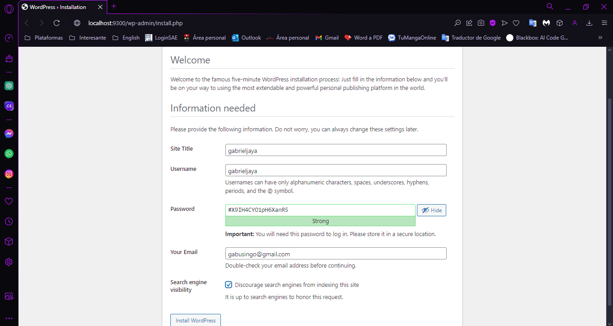
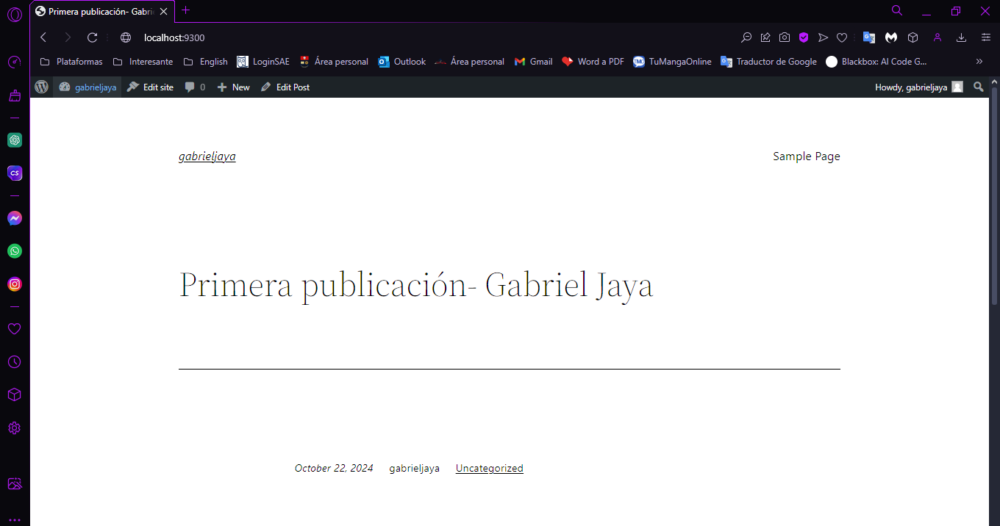

## Esquema para el ejercicio


### Crear la red
```
docker network create net-wp -d brige
```

### Crear el contenedor mysql a partir de la imagen mysql:8, configurar las variables de entorno necesarias
```
docker run -d --name mysqlContenedor --network net-wp -e MYSQL_ROOT_PASSWORD=secretpassword -e MYSQL_DATABASE=wordpress_db -e MYSQL_USER=wp_user -e MYSQL_PASSWORD=wp_password mysql:8
```

### Crear el contenedor wordpress a partir de la imagen: wordpress, configurar las variables de entorno necesarias

```
docker run -d --name wordpress --network net-wp -e WORDPRESS_DB_HOST=mysql:3306 -e WORDPRESS_DB_USER=wp_user -e WORDPRESS_DB_PASSWORD=wp_password -e WORDPRESS_DB_NAME=wordpress_db -p 9300:80 wordpress
```


De acuerdo con el trabajo realizado, en la el esquema de ejercicio el puerto a es 9300

Ingresar desde el navegador al wordpress y finalizar la configuración de instalación.



Desde el panel de admin: cambiar el tema y crear una nueva publicación.


Ingresar a: http://localhost:9300/ 
recordar que a es el puerto que usó para el mapeo con wordpress


### Eliminar el contenedor wordpress
```
docker rm wordpress
```
# COMPLETAR

### Crear nuevamente el contenedor wordpress


Ingresar a: http://localhost:9300/ 
recordar que a es el puerto que usó para el mapeo con wordpress


### ¿Qué ha sucedido, qué puede observar?
La primera vez que cargo la publicacion no se me reflejo el cambio de tema. Pero al volver a instalar wordpress este si sale cambiado, por lo que los datos persisten a pesar de que borro el contenedor. Esto por que esta almacenado en la base de datos MySQL en un contenedor separado. 


